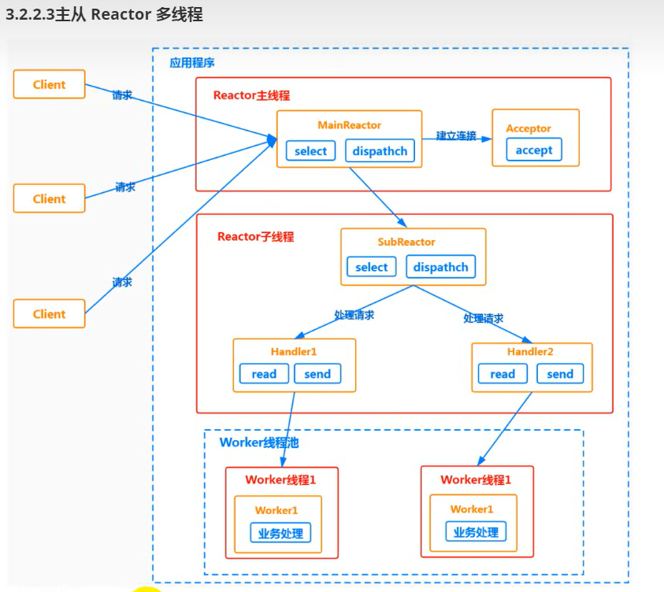
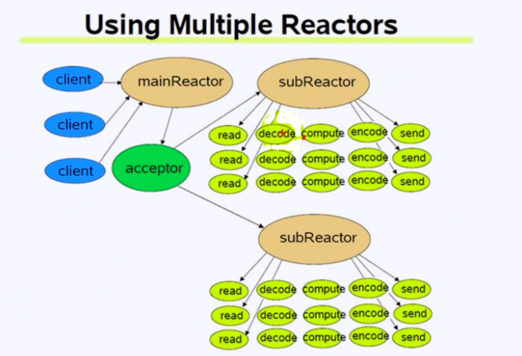
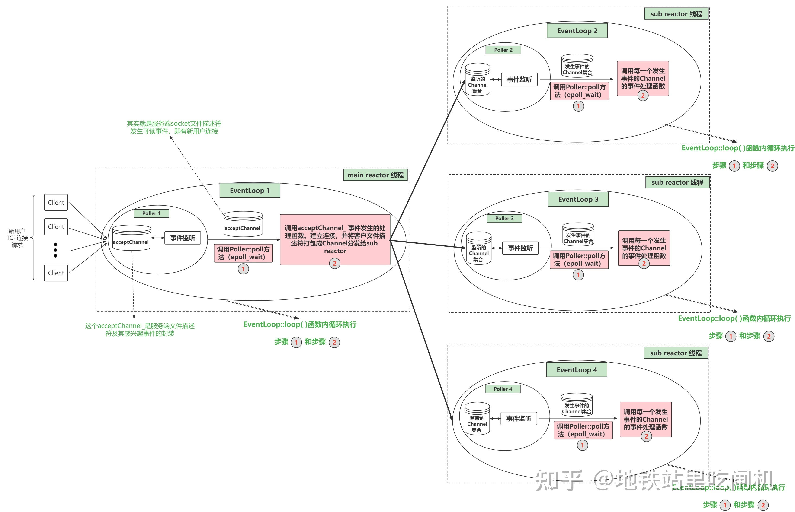

# 跟着陈硕大神实现muduo库
### [学习视频链接]("https://www.bilibili.com/video/BV11b411q7zr/?spm_id_from=333.337.search-card.all.click")
-------------------

### muduo 库的主要采用`Multi-Reactor模型`，具体如下图

---------------------------------------------
### muduo 库的核心结构

[图片来源]("https://zhuanlan.zhihu.com/p/495016351")
